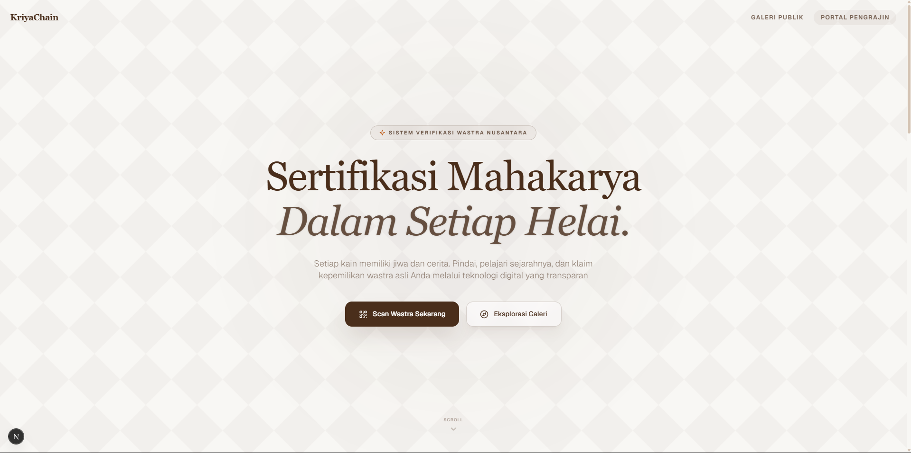
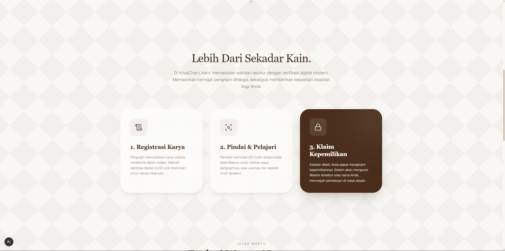
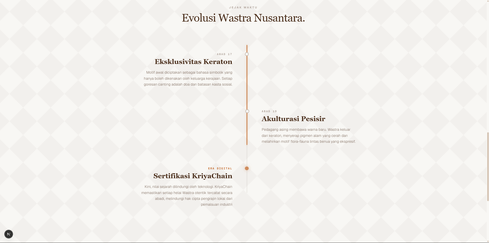
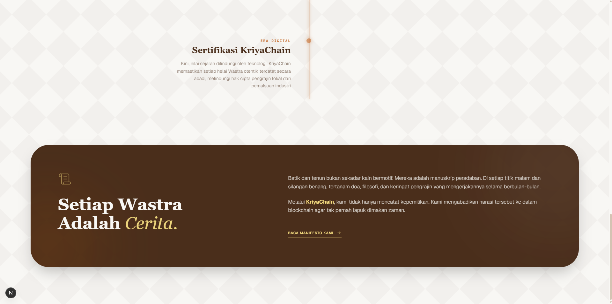
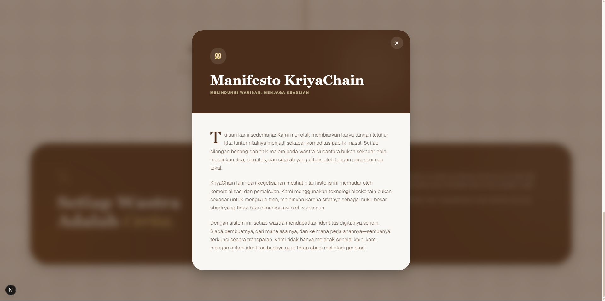
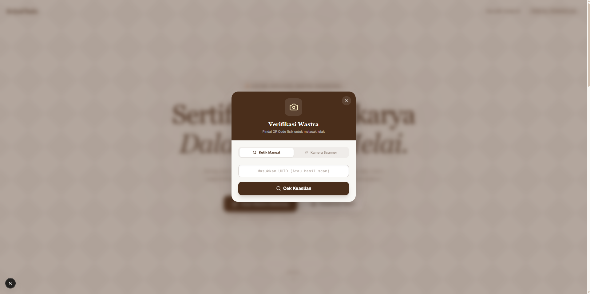

# KriyaChain

**A QR-code-based provenance and ownership tracking system for Indonesian wastra (traditional woven textile) craftsmanship.**

Counterfeit and unverifiable-origin goods are a persistent problem in handcrafted textile markets. KriyaChain gives each wastra/batik piece a unique QR code that acts as a portable certificate of authenticity — scanning it reveals the item's registered origin and its full ownership history, and ownership can be formally transferred (and recorded) when the piece changes hands.

> **A note on the name:** despite "Chain," this isn't built on blockchain/distributed ledger technology — there's no Web3 or smart contract layer here. Ownership history is modeled as an append-only ledger table (`TransferHistory`) in a standard PostgreSQL database. The chain-of-custody *concept* is blockchain-inspired; the implementation is a conventional relational backend. Worth being upfront about, since the name alone might suggest otherwise.

---

## Features

- **Product registration** — register a new wastra/batik piece, generating a unique QR code tied to it
- **QR scan lookup** — scan a piece's QR code to view its registered details and full history
- **Ownership claim** — the current holder of a piece can claim/register themselves as its owner
- **Ownership transfer** — formally transfer a piece to a new owner, appended to its permanent history (not overwritten)
- **Ownership history timeline** — full chronological record of everyone who has held a given piece
- **Stats dashboard** — aggregate view across registered products
- **CSV export** — export the product registry for external use
- **Product editing** — update registered product details

## Tech Stack

| Layer | Technology |
|---|---|
| Frontend (`wastra-frontend/`) | Next.js 16, React 19, TypeScript, Tailwind CSS v4, Framer Motion |
| QR handling | `react-qr-code` (generation), `@yudiel/react-qr-scanner` (scanning) |
| Backend (`prepdev-backend/`) | Go, Gin, GORM, PostgreSQL |
| Rate limiting | Per-IP token bucket (`golang.org/x/time/rate`) |

## API Reference

| Endpoint | Method | Purpose |
|---|---|---|
| `/api/products` | `POST` | Register a new product |
| `/api/products` | `GET` | List all registered products |
| `/api/products/scan/:qr_code` | `GET` | Look up a product by its QR code |
| `/api/products/claim/:qr_code` | `PUT` | Claim ownership of a product |
| `/api/products/transfer/:qr_code` | `PATCH` | Transfer ownership, recorded in history |
| `/api/products/history/:qr_code` | `GET` | Full ownership history for a product |
| `/api/products/edit/:qr_code` | `PATCH` | Edit product details |
| `/api/products/export` | `GET` | Export product registry as CSV |
| `/api/stats` | `GET` | Aggregate statistics |

## Getting Started

### Prerequisites
- Go 1.25+
- Node.js 18+
- PostgreSQL

### Backend

```bash
cd prepdev-backend
cp .env.example .env   # set database credentials
go mod tidy
go run main.go          # auto-migrates schema, runs on :8080
```

### Frontend

```bash
cd wastra-frontend
npm install
npm run dev
```

## Screenshots

<table>
  <tr>
    <td align="center"></td>
    <td align="center"></td>
    <td align="center"></td>
  </tr>
  <tr>
    <td align="center"></td>
    <td align="center"></td>
    <td align="center"></td>
  </tr>
</table>

## Known Limitations

- CORS is currently wide open (`Access-Control-Allow-Origin: *`) — fine for local development, should be restricted to a specific origin before any real deployment
- The rate limiter tracks IPs in an in-memory map, which resets on restart and won't work correctly across multiple server instances — acceptable for a single-instance demo, not for horizontal scaling
- No authentication layer yet — anyone with the API URL can register or transfer products; ownership "claims" aren't currently tied to verified user accounts

---

*Built with Go, Gin, and Next.js.*